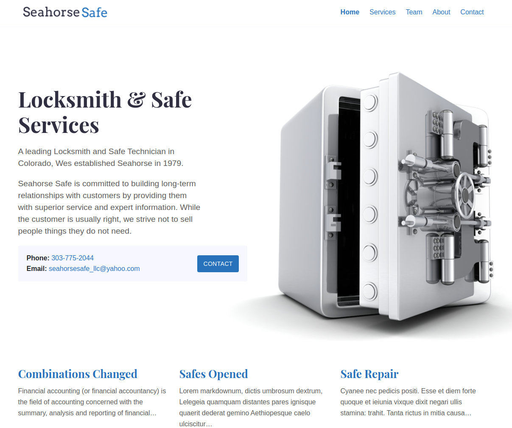

# Seahorse Safe

A small business website built with Serif - a beautiful Gatsby Theme. Fully responsive, blazing fast and artfully illustrated.

[Live Site](https://seahorse-safe.netlify.app/) | 
[Zerostatic Themes (Serif theme creator)](https://www.zerostatic.io/)



## Site features

- Gatsby v3
- Multi-page theme (not just a blog) that uses Markdown for multiple content-types/templates. It uses `gatsby-transformer-remark` and has several examples of querying and filtering `allMarkdownRemark`
- Includes a graphql query in `gatsby-node.js` that creates pages and templates by content type based on the folder `src/pages/services`, `src/pages/team`,
- Services (Markdown)
- Certification (Markdown)
- Features (Data)
- SCSS using `gatsby-plugin-sass`
- Responsive design
- Bootstrap 4 grid and media queries only
- Responsive menu
- Robust example content included
- Royalty free illustrations included
- SEO Titles & Meta using `gatsby-plugin-react-helmet`
- ESLint

## Install

gatsby 3 and node-sass 5 requires node v14 or higher

```
npm install
```

```
npm run develop
```

```
npm run build
```